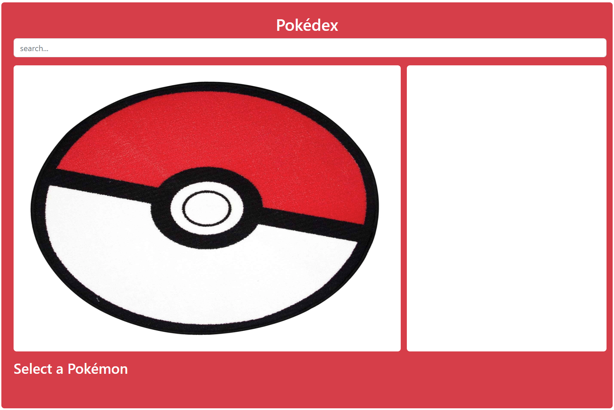
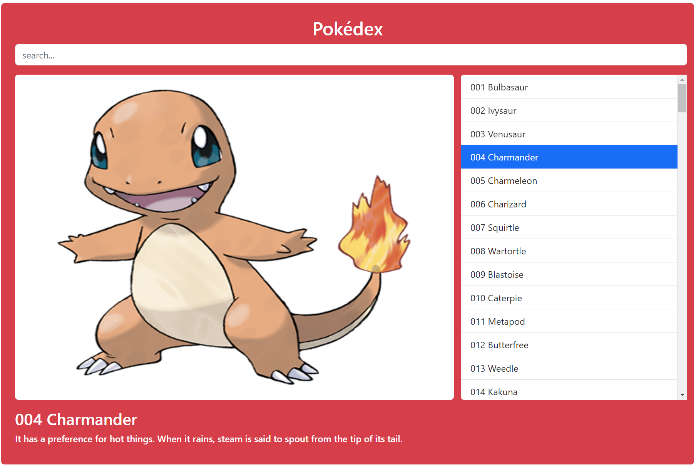

# Programming Basic Tutorial

The repository you just opened contains a practice project
for the Programming Basics course at HZ University of Applied Sciences.
It uses all the concepts covered during the course.
The repository contains a start and an end folder,
which contain the starter code and a potential solution to the assignment.

## The Assignment

A front-end developer has been hard at work to create an interface for a Pokédex.
The plan is to turn this into a working website that
allows people to get basic information on the different Pokémon.
But there is some work to do that the they can't do. That is where you come in!

Data on each pokémon has been downloaded and stored in a
`.json` file in `js/pokemon.json`.
The same folder contains a JavaScript file that should contain the logic.
By writing the rights functions, you're going to turn the application from the example above,
to what's displayed in the example below. The things you have to do are:

1. Make a list of all the pokémon and display them on the right.
2. Make sure that the user can select a pokémon from the list.
3. Highlight the selection.
4. Display the image of the selected pokémon on the left.
5. Display the name and description of the selected pokémon on the bodem.
6. Make sure the user can search for a pokémon by name.
7. Make sure the user can search for a pokémon by number.

There is no need for you to write HMTL and CSS.
Use the following classes: `list-group-item`,
`list-group-item-action`, `clickable`, `active`.
It is up to you to determine where and how to use them. The HTML-elements that should be dynamically generated should be inferred from the HTML-file.

## Hints

    
Hint 1: Required event handlers

    You need a two types of event handlers.

    The onclick event is used for selecting pokémon.
    The oninput event is used for the 'dynamic' searching.

    
Hint 2: Recommended functions

    In the example solution, six functions were added.

    1. search
    2. generatePokemonList
    3. generateListItem
    4. selectPokemonFromList
    5. displayPokemonData
    6. getPokemonNumberAndName

